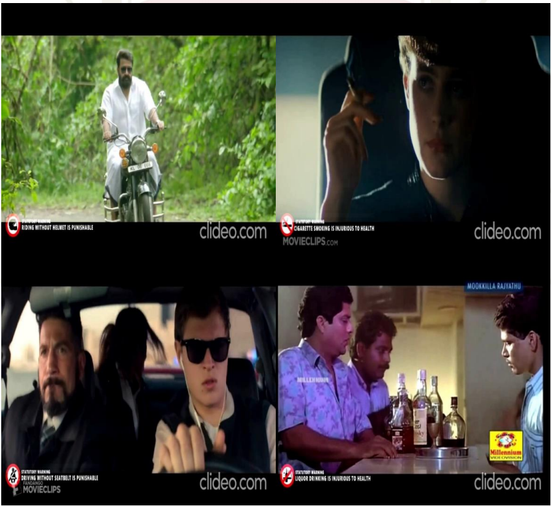

# CensorLabel
 
Automated censorable content identification system for movie using deeplearning. This project automatically add statutory warnings in movies when any censorable contents where shown in the movies.
The Project is developed using YOLOV3 and OpenCV...

This system is used for smoking detection, Check whether the motorcyclist weared helmet or not, driving without wearing seatbelt and alcohol detection.

## Requirements

* Python 3
* Opencv
* FFMpeg
* Tkinter

## Installation

`pip install -r requirements.txt`

## Result

## Support

Open for contributing to this project. Ping me on linkedin https://linkedin.com/in/akhilgkrishnan
